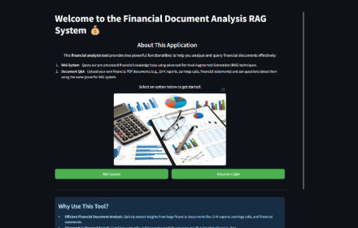
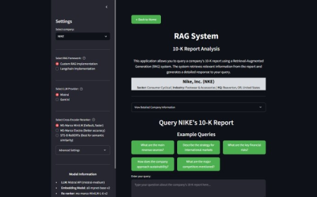
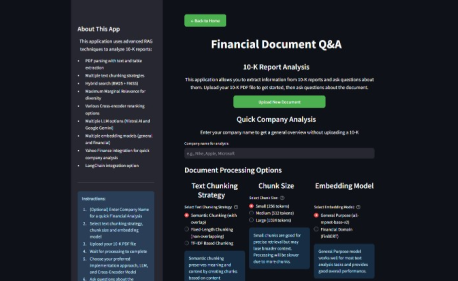

# FinRAG: Retrieval-Augmented Intelligence for Financial Document Analysis


A powerful financial document analysis tool that leverages Retrieval Augmented Generation (RAG) techniques to extract insights from 10-K reports and other financial documents.

## 📸 Application Overview

<div align="center">
  <table>
    <tr>
      <td align="center"><b>Home Page</b></td>
      <td align="center"><b>RAG System</b></td>
      <td align="center"><b>Document Q&A</b></td>
    </tr>
    <tr>
      <td></td>
      <td></td>
      <td></td>
    </tr>
  </table>
</div>


## 🌟 Features

- **Dual Functionality**: 
  - Pre-processed financial knowledge base querying
  - Upload and analyze your own financial documents

- **Advanced RAG Implementation**:
  - Hybrid search combining semantic (FAISS) and keyword (BM25) approaches
  - Maximum Marginal Relevance (MMR) for diverse results
  - Cross-encoder reranking for improved result quality

- **Multiple AI Models**:
  - Support for Mistral AI and Google Gemini LLMs
  - Various embedding models (general and financial domain-specific)
  - Multiple cross-encoder reranker options

- **PDF Processing**:
  - Text extraction with layout preservation
  - Table detection and extraction
  - Multiple text chunking strategies (semantic, fixed-length, TF-IDF)

- **Company Information**:
  - Integration with Yahoo Finance API
  - Quick company overview and financial metrics
  - Market data, valuation metrics, and executive information

- **Implementation Options**:
  - Custom RAG pipeline with fine-tuned parameters
  - LangChain-based implementation with ensemble retrieval

## 📋 Requirements

- Python 3.8+
- Streamlit 1.25+
- PyTorch
- FAISS
- Sentence Transformers
- NLTK
- PyPDF2
- Tabula
- Rank BM25
- LangChain
- yfinance

## 🚀 Installation

1. Clone the repository:
```bash
git clone https://github.com/aatmaj28/FinRAG.git
cd FinRAG
```

2. Install dependencies:
```bash
pip install -r requirements.txt
```

3. Download NLTK resources:
```python
import nltk
nltk.download('punkt')
```

4. Set up your API keys:
Edit the code to include your API keys for Mistral AI and Google Gemini.

## 🏃‍♀️ Running the Application

Start the application with:
```bash
streamlit run main.py
```

The application has three main components:
- **Home Page**: Navigation hub for accessing different features
- **RAG System**: Query the pre-processed financial knowledge base
- **Document Q&A**: Upload and analyze your own financial documents

## 🔧 Usage Guide

### RAG System

1. Select a company from the dropdown menu
2. Choose your preferred RAG implementation (Custom or LangChain)
3. Select the LLM provider (Mistral or Gemini)
4. Choose a cross-encoder model for reranking (Custom RAG only)
5. Enter your query or select from example queries
6. Review the response and explore retrieved contexts

### Document Q&A

1. Configure document processing options:
   - Select a text chunking strategy
   - Choose chunk size
   - Select embedding model
2. Upload your 10-K or financial PDF document
3. Enter the company name
4. Wait for processing to complete
5. Follow the same query process as the RAG System

## 📊 RAG System Architecture

The system uses a hybrid retrieval approach combining:

1. **Dense Retrieval (Semantic Search)**:
   - Sentence Transformer embeddings
   - FAISS vector similarity search

2. **Sparse Retrieval (Keyword Search)**:
   - BM25 algorithm for keyword matching

3. **Hybrid Ranking**:
   - Weighted combination of semantic and keyword scores
   - Maximum Marginal Relevance for diversity
   - Cross-encoder reranking for final result quality

4. **Response Generation**:
   - Top contexts sent to Mistral AI or Google Gemini API
   - Contextual response generation with 100-word target

## 📁 Project Structure

```
financial-document-analysis/
├── main.py                  # Main application entry point
├── App1.py                  # RAG System implementation
├── App2.py                  # Document Q&A implementation
├── requirements.txt         # Project dependencies
├── Company 10-K's/          # Processed company data
│   └── COMPANY_NAME/        # Specific company folder
│       ├── *_index.faiss    # FAISS vector index
│       ├── *_metadata.pkl   # Document metadata
│       ├── *_bm25.pkl       # BM25 index
│       └── langchain/       # LangChain implementation files
└── FA.jpg                   # Application logo/image
```

## 🛠️ Advanced Customization

### Text Chunking Strategies

- **Semantic Chunking**: Preserves meaning with content relationships (recommended for complex documents)
- **Fixed-Length Chunking**: Simple uniform chunks without overlap (faster processing)
- **TF-IDF Based Chunking**: Content-aware chunking based on term importance (good for topically distinct sections)

### Embedding Models

- **General Purpose (all-mpnet-base-v2)**: Works well for most text analysis tasks
- **Financial Domain (FinBERT)**: Specialized for financial terminology and contexts

### Cross-Encoder Models

- **MiniLM-L-6**: Fastest option with good performance
- **ELECTRA-Base**: Good balance between speed and quality
- **RoBERTa-Base**: Highest quality but slower performance

## ⚠️ Limitations

- Processing large PDFs may require significant memory and CPU resources
- API rate limits apply to the Mistral AI and Google Gemini services
- Table extraction requires Java to be installed for optimal performance
- Yahoo Finance data may not be available for all companies or may be delayed

## 🔑 API Keys

This application requires API keys for:
- Mistral AI: Get from [Mistral AI platform](https://mistral.ai/)
- Google Gemini: Get from [Google AI Studio](https://makersuite.google.com/)

## 🤝 Contributing

Contributions are welcome! Please feel free to submit a Pull Request.

## 🎯 Motivation

This project was developed to address the significant challenge organizations face when trying to quickly extract relevant information from large financial documents. Instead of manually sifting through hundreds of pages of 10-K reports, earnings calls, and financial statements, this tool enables users to find precise answers through natural language queries.

The system was created as part of the CS 6120: Natural Language Processing course, applying advanced NLP techniques to solve real-world information retrieval problems in the financial domain.

## 📧 Contact

For questions or support, please open an issue in the GitHub repository or contact Aatmaj Salunke @aatmajsalunke@yahoo.com
